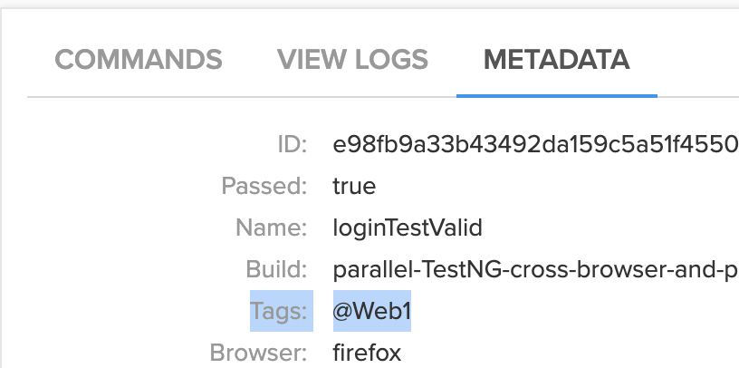
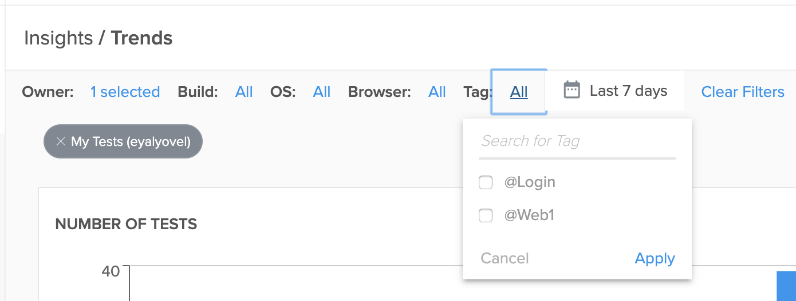

## Java-TestNg-Selenium-Cross-Browser

This code is provided on an "AS-IS” basis without warranty of any kind, either express or implied, including without limitation any implied warranties of condition, uninterrupted use, merchantability, fitness for a particular purpose, or non-infringement. Your tests and testing environments may require you to modify this framework. Issues regarding this framework should be submitted through GitHub. For questions regarding Sauce Labs integration, please see the Sauce Labs documentation at https://wiki.saucelabs.com/. This framework is not maintained by Sauce Labs Support.

### About the frameork
* Java testng Selenium framework to execute automated tests on different browsers and platforms.
* The execution is done on Sauce Labs cloud or locally.
* Using testng xml file for easy configuration of browsers and platforms and for parallel execution.
* Tags - Using Tests tags help manage the test execution flows and the results at the end, and they gather insights and trends throughout CI jobs, builds, and other milestones.
Using the framework, you can define tags as part of the tests and distinguish and gain better flexibility when running a test in various contexts and under different conditions. (please read more in the "Using Tags" section)

### Environment Setup

1. Global Dependencies
    * [Install Maven](https://maven.apache.org/install.html)
    * Or Install Maven with [Homebrew](http://brew.sh/)
    ```
    $ brew install maven
    ```
2. Sauce Credentials
    * In the terminal export your Sauce Labs Credentials as environmental variables:
    ```
    $ export SAUCE_USERNAME=<your Sauce Labs username>
	$ export SAUCE_ACCESS_KEY=<your Sauce Labs access key>
    ```

### testng XML files

* The testng xml files are located in "src/test/resources/config"
* Each  < test >  is configured to run your tests on specific browser and platform
* There are 3 types of API you can use: 
	* 
```
<parameter name="API" value="Legacy"></parameter>
``` . 
Legacy (JSON Wire Protocol) is a protocol previously used by Selenium for automating web browsers. 
The tests will run on Sauce platform
	* 
```
<parameter name="API" value="W3C"></parameter>
```. 
WebDriver (W3C) is an automation standard used by tools like Selenium or Webdriver.io for automating web browsers.
The tests will run on Sauce platform. 
	* ``` 
<parameter name="API" value="local"></parameter>
``` . 
The tests will run on your local machine (in this example - local chrome). 

* Parameters that start with 'cap' will be added to the driver capabilities
```
<parameter name="API" value="Legacy"></parameter>
<parameter name="cap:browserName" value="safari"></parameter>
<parameter name="cap:version" value="13.1"></parameter>
<parameter name="cap:platform" value="macOS 10.15"></parameter>
```
* For the W3C support - parameters that start with 'sauce' will be added to the 'sauce:options' capability
```
<parameter name="API" value="W3C"></parameter>
<parameter name="browser" value="chrome"></parameter>
<parameter name="sauce:screenResolution" value="1152x864"></parameter>
```
### Using Tags
* You can define tags/groups as part of the test. For example
```
   @Test(groups = { "@Web1" , "@Login"})
    public void loginTestValidPerfGlitch() {
```
* In the xml file, use the group section to define which tests to execute according to the tags:
```
<groups>
    <run>
        <include name="@Web1" />
    </run>
</groups>
```
* You should use tags that are meaningful and valuable to your teams. For example: using tags for test types ( @Regression, @Smoke) or using tags for team names ( @UI_Team, @Android_Team)
* The tags will be added to the test result

 And you can use the Insights / Trends to filter using the tags
 
### Running Tests

```
$ mvn clean install -DtestngXmlFile=<the testng xml file>
```
Example:
```
$ mvn clean install -DtestngXmlFile=testng_web_all.xm
```

[Sauce Labs Dashboard](https://saucelabs.com/beta/dashboard)

### Advice/Troubleshooting
1. It may be useful to use a Java IDE such as IntelliJ or Eclipse to help troubleshoot potential issues. 
2. There may be additional latency when using a remote webdriver to run tests on Sauce Labs. Timeouts or Waits may need to be increased.
    * [Selenium tips regarding explicit waits](https://wiki.saucelabs.com/display/DOCS/Best+Practice%3A+Use+Explicit+Waits)

### Resources
##### [Sauce Labs Documentation](https://wiki.saucelabs.com/)

##### [SeleniumHQ Documentation](http://www.seleniumhq.org/docs/)

##### [TestNg Documentation](http://testng.org/javadocs/index.html)

##### [Java Documentation](https://docs.oracle.com/javase/7/docs/api/)

##### Stack Overflow:
* [Related Stack Overflow Threads](http://stackoverflow.com/questions/27355003/advise-on-hierarchy-for-element-locators-in-selenium-webdriver)
